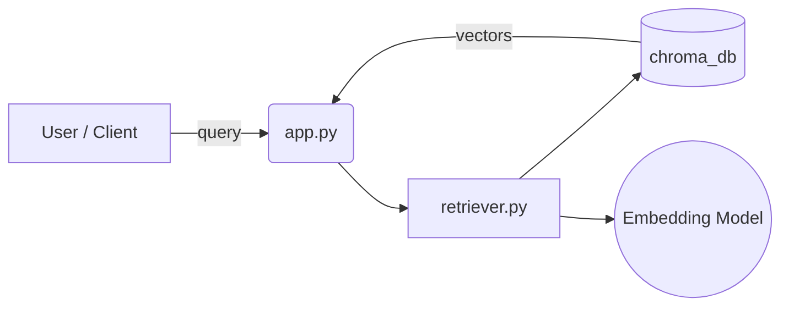
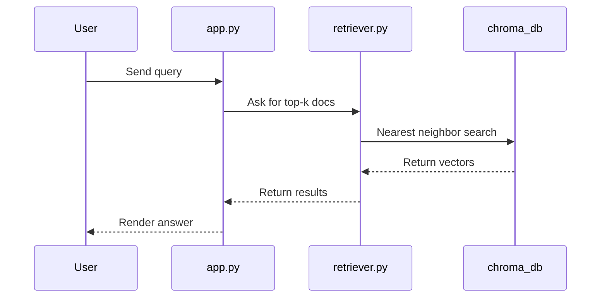

# DevDocs-AI — Your Docs, Conversationally Supercharged


DevDocs-AI is a lean, fast project that transforms your local documentation into an intelligent, conversational assistant. Drop in your docs, spin up the vector DB, and talk to your product knowledge — zero fluff, maximum clarity.

Why you'll love it
- Fast local vector search powered by Chroma.
- Minimal footprint: tiny codebase, big results.
- Designed for devs: inspectable, tweakable, and extendable.

Key files
- `app.py`: primary app entry (conversational interface).
- `retriever.py`: vector retrieval helpers.
- `evaluator.py`: evaluation & scoring utilities.
- `requirements.txt`: Python dependencies.
- `chroma_db/`: persisted Chroma database (already contains `chroma.sqlite3`).

Quick start

1. Create a virtual environment and activate it.

```bash
python -m venv venv
# Windows
venv\Scripts\activate
# macOS / Linux
source venv/bin/activate
```

2. Install requirements

```bash
pip install -r requirements.txt
```

3. Run the app

```bash
python app.py
```

What to expect
- `app.py` will load the vector store in `chroma_db/` and serve a simple conversational interface to query your docs.
- Use `retriever.py` to embed and fetch nearest-neighbors programmatically.
- `evaluator.py` contains utilities to benchmark retrieval + response quality.

Architecture


System flow (visualized):



Sequence (simplified):



Example usage (Python)

```python
from retriever import Retriever

ret = Retriever(db_path='chroma_db')
answers = ret.query('How do I deploy the service?')
print(answers[0])
```

Tips & tricks
- Seed the `chroma_db/` by running your ingestion pipeline (or re-run embedding updates from `retriever.py`).
- Tweak embedding model and retriever parameters for speed vs. accuracy tradeoffs.

Contributing
- Tidy, focused PRs welcome.
- Please add tests for new features and keep the README updated with any new CLI or env var.

License
- MIT — see LICENSE file.

Need help?
- Open an issue or ping the maintainer. Want me to: add a demo GIF, CI badges, or a one-click Dockerfile? Say the word and I'll scaffold it.

Enjoy fast, local, developer-first docs with a human voice.
